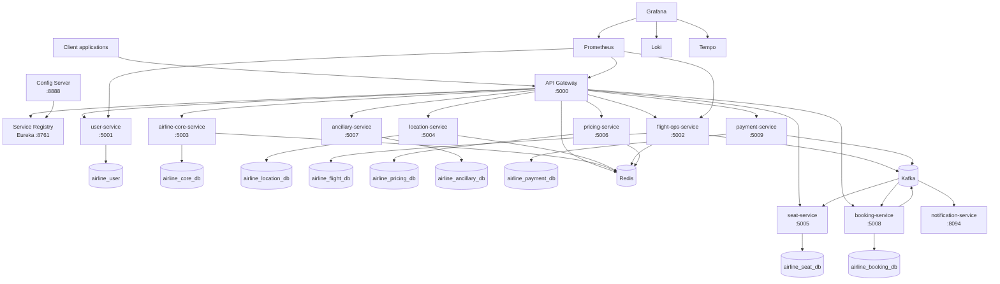
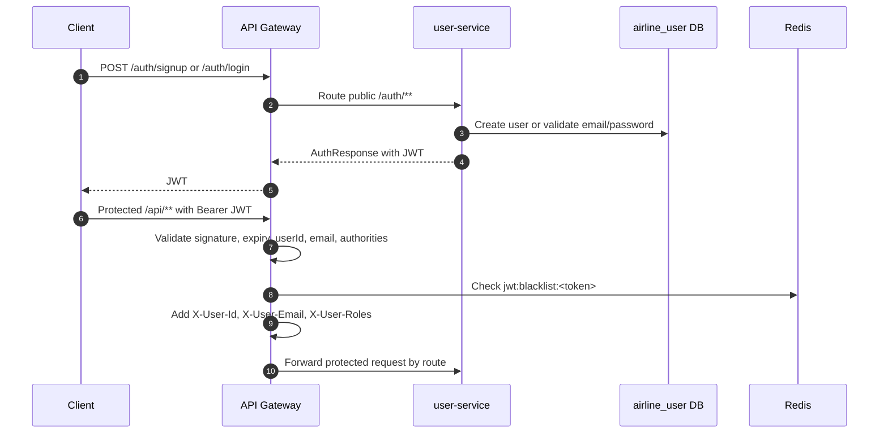
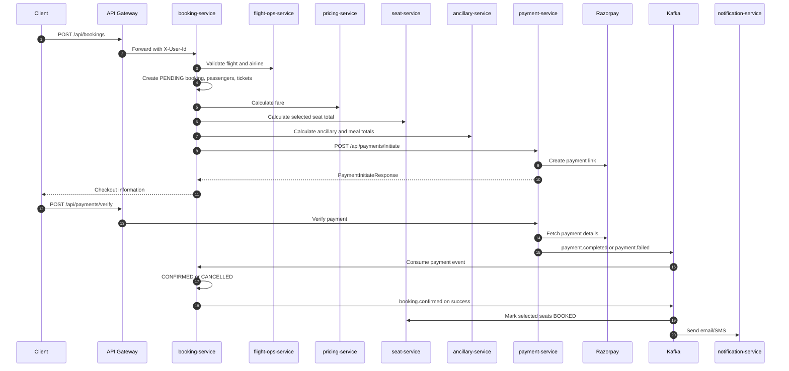
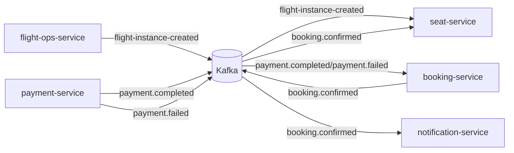
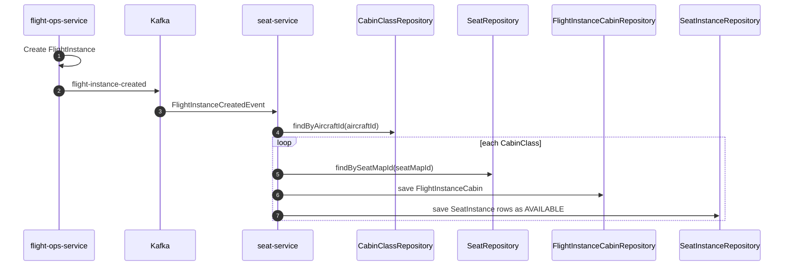
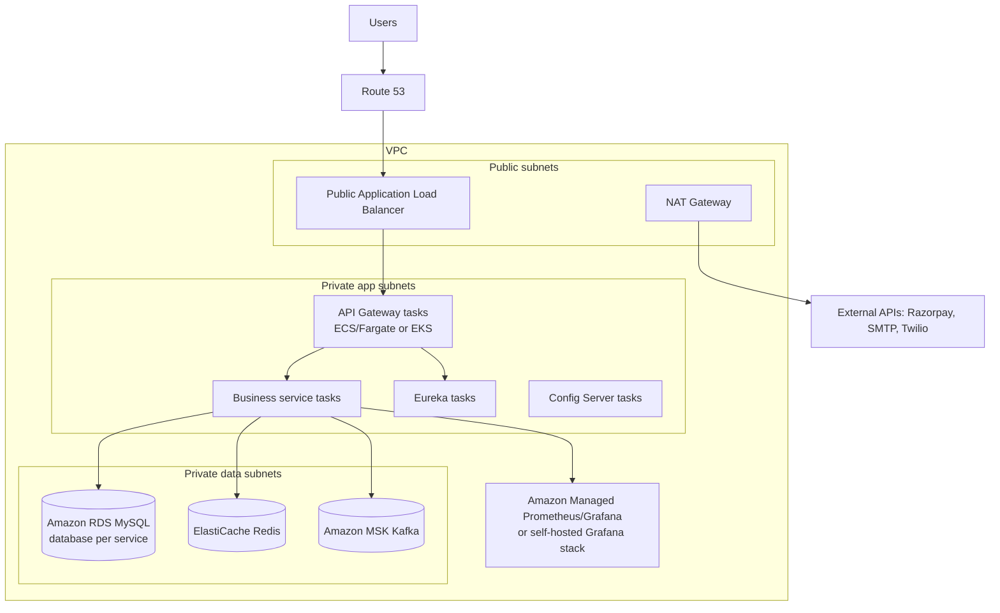

# TravelSphere Architecture

This document describes the architecture implemented by the source code, Maven modules, Spring configuration, Kafka consumers/producers, Redis usage, and Docker Compose files in this repository.

## Overall Microservice Architecture



## Service Responsibilities

- `api-gateway`: public entry point, JWT validation, Redis token blacklist lookup, route-level role checks for selected admin routes, Resilience4j circuit breakers, Eureka load balancing.
- `user-service`: signup, login, BCrypt password checks, JWT generation, user lookup and profile APIs.
- `airline-core-service`: airline and aircraft lifecycle APIs, Redis-backed cache for airline and aircraft reads.
- `location-service`: city and airport APIs, Redis-backed cache for frequently read location data.
- `flight-ops-service`: flights, schedules, flight instances, flight search, Feign calls to airline/location/seat/pricing, Kafka producer for flight instance creation, Redis cache for flight instance reads.
- `seat-service`: cabin classes, seat maps, template seats, runtime seat instances, Kafka consumers for flight instance creation and booking confirmation.
- `pricing-service`: fares, fare rules, baggage policies, Redis-backed fare cache.
- `ancillary-service`: ancillaries, meals, insurance coverage, flight meals, flight cabin ancillaries, Feign calls to airline/location/seat where required.
- `booking-service`: booking aggregate, passenger/ticket records, price orchestration, payment initiation, payment event consumption, booking confirmation event publishing.
- `payment-service`: payment record lifecycle, Razorpay link creation/verification, user lookup by Feign, payment event publishing.
- `notification-service`: consumes `booking.confirmed`, renders Thymeleaf email, sends SMTP email and optional Twilio SMS.
- `subscription-service`: Spring Boot module scaffold with web, JPA, Eureka, Actuator, and observability dependencies.

## Request Flow

1. A client sends requests to `api-gateway` on port `5000`.
2. Public `/auth/**` routes go to `user-service` without JWT checks.
3. Protected `/api/**` routes pass through the gateway JWT filter.
4. The gateway validates token signature/expiration, checks Redis for revocation, and forwards identity headers.
5. Gateway route functions apply circuit breakers and use Eureka-backed load balancing.
6. Domain services perform local persistence and call other services through OpenFeign where needed.

## Authentication Flow



Logout is handled by `POST /auth/logout` in the gateway. The gateway extracts the token, calculates remaining validity, and stores it in Redis with that TTL.

## Flight Booking Sequence



## Kafka Event Flow



Topic details:

- `flight-instance-created`: payload `FlightInstanceCreatedEvent`; creates runtime seat inventory.
- `payment.completed`: payload `PaymentCompletedEvent`; confirms booking.
- `payment.failed`: payload `PaymentFailedEvent`; cancels pending booking.
- `booking.confirmed`: payload `BookingConfirmedEvent`; updates seat status and sends notifications.

## Seat Generation Flow



## Cache Flow

```mermaid
flowchart TD
  Request[Service method with @Cacheable] --> Cache{Redis cache hit?}
  Cache -- yes --> Cached[Return cached value]
  Cache -- no --> DB[(MySQL)]
  DB --> Store[Store result in Redis]
  Store --> Response[Return response]
  Mutating[Create/update/delete] --> Evict[@CacheEvict/@CachePut]
  Evict --> Redis[(Redis)]
```

Redis-backed Spring Cache is configured in airline, location, pricing, and flight operations services. The gateway uses Redis directly through `StringRedisTemplate` for token blacklisting.

## Observability Flow

```mermaid
flowchart LR
  Services[Spring Boot services] --> Actuator[/actuator/prometheus]
  Prometheus[Prometheus] --> Actuator
  Services --> Loki[Loki via Logback appender]
  Services --> Tempo[Tempo via Zipkin exporter]
  Grafana[Grafana] --> Prometheus
  Grafana --> Loki
  Grafana --> Tempo
```

The application configuration exposes health/info/metrics/prometheus endpoints on most services. Trace IDs and span IDs are included in logging patterns, and tracing sampling is configured at `1.0` in service YAML files.

## AWS Deployment Architecture



The AWS diagram is a production deployment target derived from the Compose topology: one public gateway tier, private service tier, private data tier, managed MySQL/Redis/Kafka replacements, and centralized observability.
