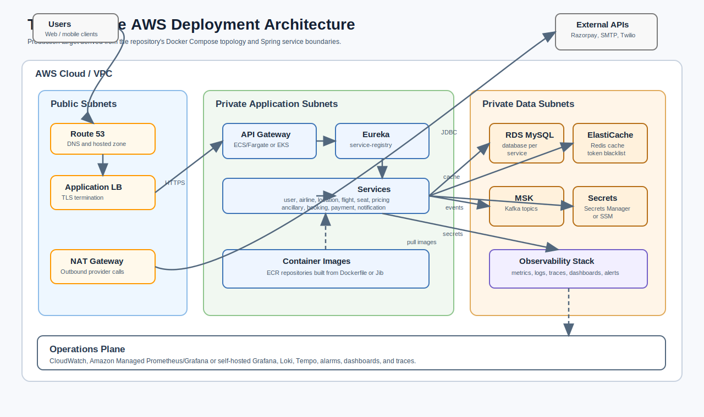

# TravelSphere Deployment

This guide describes the local Docker deployment provided by the repository and a production AWS deployment shape that preserves the same service boundaries.

## Local Docker Deployment

The main Compose file is `backend/microservices/docker-compose/docker-compose.yml`. It starts MySQL databases, Redis, Kafka, Eureka, the API Gateway, and most business services. Only the API Gateway is externally exposed on port `5000`; service databases are bound to `127.0.0.1` for debugging.

Start the production-style local stack:

```bash
cd backend/microservices/docker-compose
docker compose up -d
```

Access:

- API Gateway: `http://localhost:5000`
- User DB: `127.0.0.1:3302`
- Airline core DB: `127.0.0.1:3303`
- Flight ops DB: `127.0.0.1:3304`
- Location DB: `127.0.0.1:3305`
- Pricing DB: `127.0.0.1:3307`
- Ancillary DB: `127.0.0.1:3308`
- Booking DB: `127.0.0.1:3309`
- Payment DB: `127.0.0.1:3310`
- Seat DB: `127.0.0.1:3311`

The Compose file uses published images such as `nikhiltiwarip29/gds-api-gateway:1.0.0`, `gds-user:1.0.0`, `gds-flight:1.0.0`, and related service images. It configures each service with Docker DNS names for databases, Eureka, Redis, and Kafka.

## Developer Infrastructure Stack

`docker-compose.dev.yml` is intended for services running from an IDE or Maven on the host. It starts:

- Redis on `localhost:6379`
- Kafka on `localhost:9092`
- Kafka UI on `localhost:8080`
- Loki on `localhost:3100`
- Prometheus on `localhost:9090`
- Tempo Zipkin endpoint on `localhost:9411`
- Grafana on `localhost:3000`

Start it:

```bash
cd backend/microservices/docker-compose
docker compose -f docker-compose.dev.yml up -d
```

Then run services locally with the variables shown in each service `.env.example`, especially:

- `DB_URL`
- `DB_USERNAME`
- `DB_PASSWORD`
- `EUREKA_CLIENT_SERVICEURL_DEFAULTZONE`
- `KAFKA_BOOTSTRAP_SERVERS`
- `REDIS_HOST`
- `REDIS_PORT`
- `ZIPKIN_ENDPOINT`
- `LOKI_URL`

Build all Java modules before running:

```bash
cd backend/microservices
./mvnw clean install
```

## Local Startup Order

For local manual runs, start infrastructure first:

1. MySQL databases
2. Redis
3. Kafka
4. `service-registry`
5. `api-gateway`
6. Domain services

For booking flows, run at least:

- `user-service`
- `airline-core-service`
- `location-service`
- `flight-ops-service`
- `seat-service`
- `pricing-service`
- `ancillary-service`
- `booking-service`
- `payment-service`
- `notification-service` if confirmation messages should be sent
- Kafka and Redis

## Configuration Strategy

Service YAML files expect environment-driven runtime configuration. Database connections use `DB_URL`, `DB_USERNAME`, and `DB_PASSWORD` in most services. Kafka-enabled services use `KAFKA_BOOTSTRAP_SERVERS`. Redis-enabled services use `REDIS_HOST` and `REDIS_PORT`. Observability uses `ZIPKIN_ENDPOINT` and `LOKI_URL`.

Secrets in production should be provided by a secrets manager, not committed `.env` files.

## AWS Production Deployment

A production AWS deployment should preserve the existing runtime boundaries:



- Public edge: Route 53 plus an Application Load Balancer.
- Application tier: API Gateway and services on ECS Fargate or EKS in private subnets.
- Discovery tier: Eureka as an internal service, or replace discovery with platform-native service discovery if the code is adapted.
- Data tier: Amazon RDS MySQL, one schema/database per service boundary.
- Cache: Amazon ElastiCache Redis for token blacklisting and Spring Cache.
- Messaging: Amazon MSK Kafka or a compatible Kafka service.
- Observability: Amazon Managed Prometheus/Grafana or the repository's Prometheus/Grafana/Loki/Tempo stack adapted for production.
- Secrets: AWS Secrets Manager or SSM Parameter Store.
- Images: ECR repositories built from each module's Dockerfile or Jib configuration.

Recommended network placement:

- ALB in public subnets.
- API Gateway, domain services, and Eureka in private app subnets.
- RDS, Redis, and Kafka in private data subnets.
- NAT Gateway for outbound calls to Razorpay, SMTP, Twilio, and image/package registries where required.

## AWS Rollout Steps

1. Build and publish service images to ECR.
2. Create RDS MySQL databases matching the service-owned database names.
3. Create ElastiCache Redis and MSK Kafka clusters.
4. Store database credentials, JWT secret material, Razorpay, SMTP, and Twilio credentials in Secrets Manager or SSM.
5. Deploy Eureka internally.
6. Deploy domain services with environment variables mapped from secrets and service endpoints.
7. Deploy API Gateway behind the public ALB.
8. Configure health checks against `/actuator/health`.
9. Configure metrics scraping from `/actuator/prometheus`.
10. Validate auth, search, booking, payment verification, Kafka event delivery, seat inventory updates, and notifications.

## Production Hardening Checklist

- Do not expose service ports directly; expose only the gateway or ALB.
- Use TLS at the ALB and internal TLS where required.
- Rotate JWT and payment provider secrets.
- Disable development defaults and avoid `ddl-auto=update` for controlled database migrations.
- Replace placeholder Stripe behavior before enabling Stripe in production.
- Verify `booking-service` analytics endpoints before using them for financial reporting; the current code contains placeholder revenue/trend values.
- Configure Kafka topic retention, replication, and dead-letter handling for payment and booking events.
- Add alarms for service health, RDS storage/CPU, Kafka lag, Redis memory, 5xx rates, and payment verification failures.
